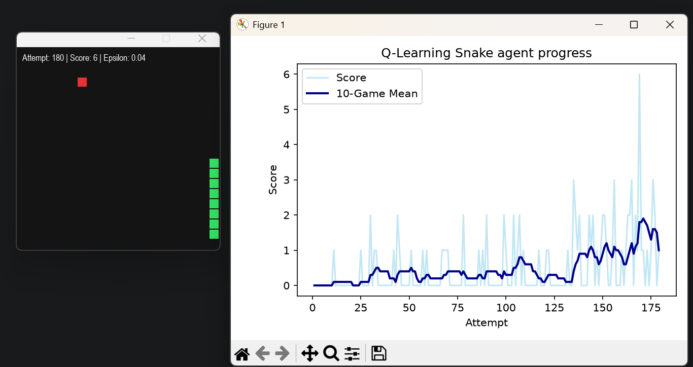
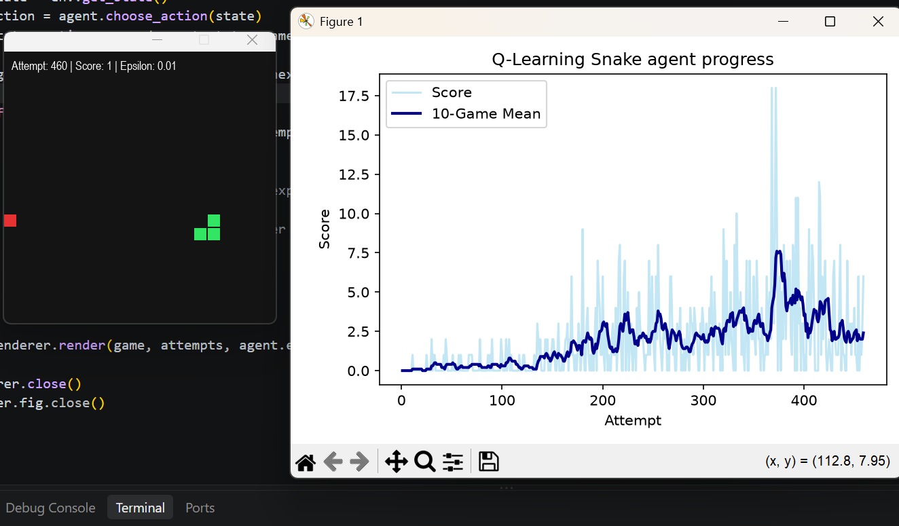

# Q_learning_snake

Introduction:

Reinforcement learning (RL) put simply is part of the machine learning ecosystem, where an agent learns from a series of reinforcements - rewards and punishemnts. For this game of Snake, a reward would come from "eating" an apple and a punishment would be the game ending. This happens by the agent either hitting a wall or its own metaphorical tail. It is up to the agent to decide which actions prior to the reinforcement were most repsonsible, and alter its actions to aim towards more rewards , which in this game means eating more apples until eventually filling out the board.

Q-Learing:
Q-Learning is an algorithm that finds the best series of actions based on an agents current state. The Q stands for quality and represnts how valuable an action is in maximising fututre rewards. 

An agent uses a Q-table which to put simply is a data structure of sets of actions and states, and the Q-learning algorithm is used to update these values. 
Running the code:

after around 200 attempts the agent is clearly starting to get the hang of its environment, but theres still room for imporvement:

after 500 approx. attempts the agent started to rely on its Q-table rather than random moves which we can see with epsilon having decayed to 0.1 from its initial 0.995 value ( which represents randomness). 

after 750 attempts:

