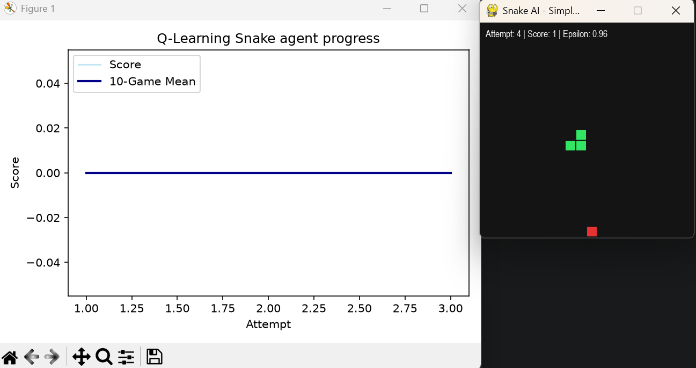
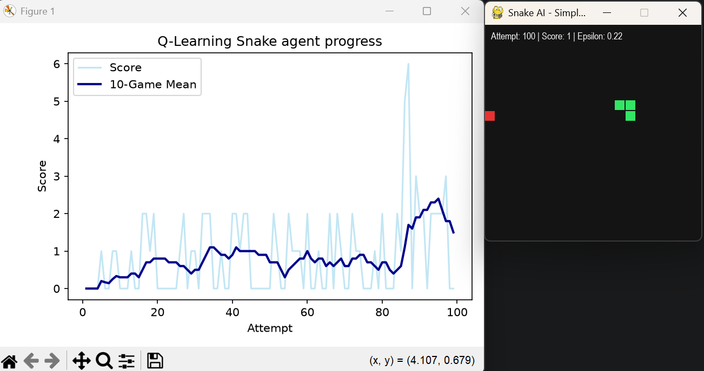
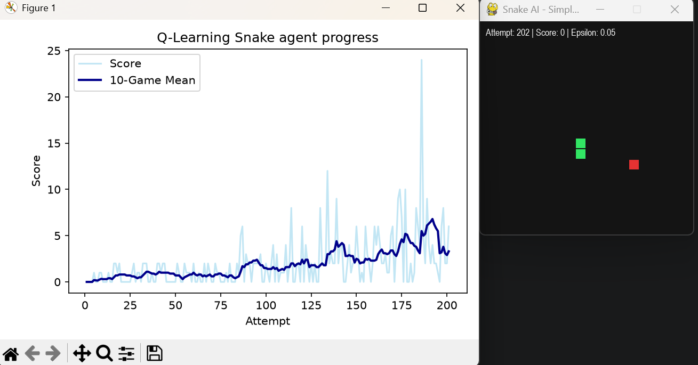
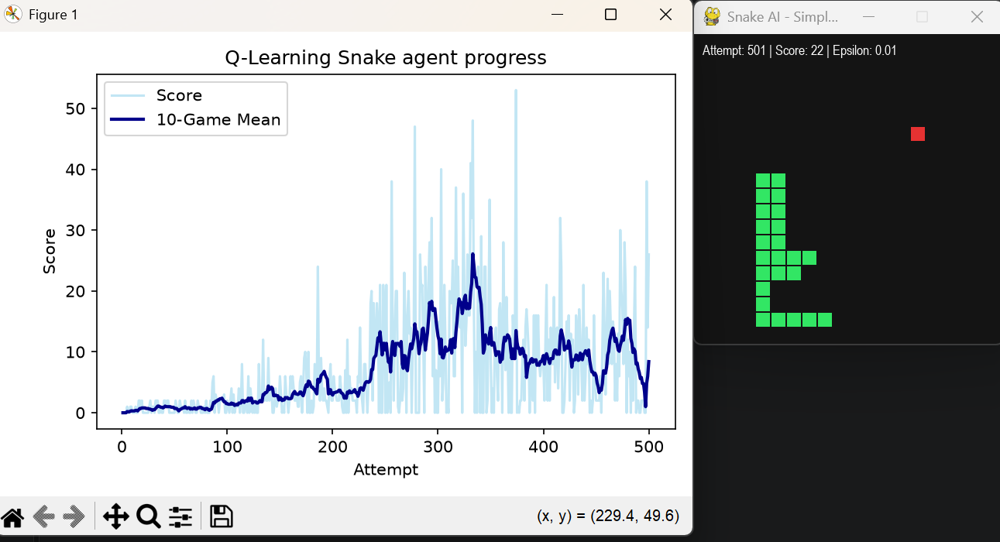
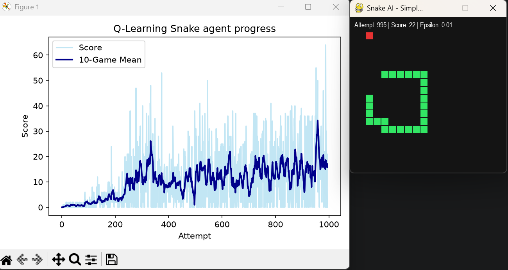
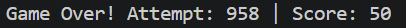
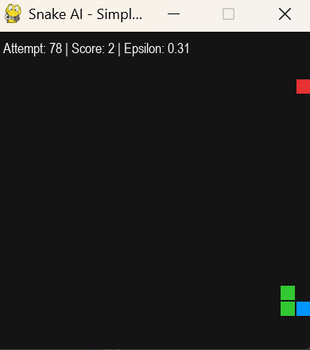

# Q_learning_snake

Introduction:
Reinforcement learning (RL) put simply is where an agent learns from a series of feedback usually refered to as rewards and punishemnts. For this game of Snake, a reward would come from "eating" an apple and a punishment would be the the agent loosing the game. This happens by the agent either hitting a wall or its own metaphorical tail. It is up to the agent to decide which actions prior to the reinforcement were most repsonsible for the reward/punishment, and alter its actions accordingly.

What is Snake?:
Snake is a simple game where a user controls a snake and leads it to food on a baord. For each piece eaten, the snake would grow in size, and the aim is to fill out the board by strategically eating all the food without loosing. To lose in the game, the snake would either have to hit a wall, or hit itself which prematurley ends the game.

Q-Learing:
Q-Learning is an algorithm that finds the best series of actions based on an agents current state. The Q stands for quality and represnts how valuable an action is in maximising fututre rewards. 

An agent uses a Q-table which to put simply is a data structure of sets of actions and states, and the Q-learning algorithm is used to update these values. 

Running the code:

100 attempts:

After around 200 attempts the agent is clearly starting to get the hang of its environment, but theres still room for imporvement:

After 500 attempts the agent starts to rely on its Q-table rather than just random moves which we can see with epsilon having decayed to from its initial 0.995 value to 0.01 (which represents randomnes of moves). 

After 1000 attempts:

What sort of issues do we experience? :
As the snake grows, with the current setup it manages to reach rather high scores but eventually it succumbs to its own length, most deaths now being to hitting itself rather than the walls.

The highest recorded score:

Future Imporvements:

To note:
- The initial code had the snake start with two body blocks rather than one. This has been amended so that the snake now starts as one block in future runs.
- An added fature of the snake head being blue was added to distinguish the head from the rest of the snakes body.

